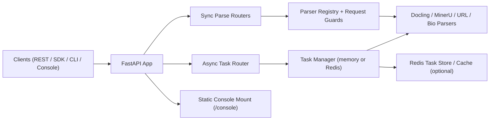

<div align="center">
  
  <h1>Markio</h1>
  <p><strong>API-first document parsing platform built with FastAPI, Docling, and MinerU</strong></p>
  <p>
    <a href="https://www.python.org/"></a>
    <a href="https://fastapi.tiangolo.com/"></a>
    <a href="https://vuejs.org/"></a>
    <a href="LICENSE"></a>
  </p>
  <p><strong>English</strong> | <a href="README.zh.md">中文</a></p>
</div>

---

## Overview

Markio converts documents and web content into Markdown or structured text through four delivery surfaces:

- FastAPI sync parsing endpoints under `/v1/parse_*`
- FastAPI async task queue endpoints under `/v1/tasks/*`
- Local Python SDK and CLI
- Vue 3 console served by FastAPI at `/console`

The project is currently **alpha** (`0.1.4`). It is suitable for internal environments, staged rollouts, and integration work, but it is not positioned as a fully hardened GA platform yet.

## Current Product Shape

- **Primary web UI**: Vue console at `/console`
- **Optional auxiliary UI**: Gradio preview/demo workflow
- **Auth model**: every `/v1/*` route requires `Authorization: Bearer <JWT>`
- **Task backend**: in-memory by default, Redis optional
- **URL parsing**: local parser, SDK local mode, and remote `/v1/parse_url` now share the same URL safety model

### What Is Supported

| Input | Dedicated endpoint | Auto-dispatch via `/v1/parse_file` |
|---|---|---|
| PDF | `/v1/parse_pdf_file` | Yes |
| DOC / DOCX | `/v1/parse_doc_file`, `/v1/parse_docx_file` | Yes |
| PPT / PPTX | `/v1/parse_ppt_file`, `/v1/parse_pptx_file` | Yes |
| XLSX | `/v1/parse_xlsx_file` | Yes |
| HTML / HTM | `/v1/parse_html_file` | Yes |
| EPUB | `/v1/parse_epub_file` | Yes |
| Image OCR | `/v1/parse_image_file` | Yes |
| URL | `/v1/parse_url` | No |
| FASTA | `/v1/parse_fasta_file` | No |
| GenBank | `/v1/parse_genbank_file` | No |

## Architecture



## Quick Start

### Prerequisites

- Python `3.11+`
- [`uv`](https://docs.astral.sh/uv/) recommended
- Node.js `18+` for frontend development and console builds
- Optional: Docker + Docker Compose
- Optional: LibreOffice for `.doc` and `.ppt`
- Optional: Redis when using `TASK_QUEUE_BACKEND=redis`

### Local backend setup

```bash
git clone https://github.com/Tendo33/markio.git
cd markio

uv sync
uv pip install -e .

cp .env.example .env
python markio/main.py
```

Required before the app can start:

- set `AUTH_JWT_SECRET` in `.env`

Open:

- API docs: [http://localhost:8000/docs](http://localhost:8000/docs)
- Health: [http://localhost:8000/healthz](http://localhost:8000/healthz)

### Build the console

The backend serves the Vue SPA only when the built frontend assets exist in `markio/webapp`.

```bash
cd frontend
npm install
npm run build
cd ..
```

Then open:

- Console: [http://localhost:8000/console](http://localhost:8000/console)

If the build output is missing, `/console` intentionally returns a helper fallback page instead of a broken SPA shell.

### Docker Compose

```bash
export AUTH_JWT_SECRET="<strong-random-secret>"
export REDIS_PASSWORD="<redis-password>"
docker compose up -d
```

Compose keeps Redis internal-only and aligns with same-origin hosting: API at `/v1/*`, console at `/console`.

## Common Workflows

### Sync parse a file

```bash
curl -X POST "http://localhost:8000/v1/parse_file" \
  -H "Authorization: Bearer <YOUR_JWT>" \
  -F "file=@./sample.docx"
```

### Parse a URL

```bash
curl -X POST "http://localhost:8000/v1/parse_url?url=https://example.com" \
  -H "Authorization: Bearer <YOUR_JWT>"
```

### Submit an async task

```bash
curl -X POST "http://localhost:8000/v1/tasks/submit" \
  -H "Authorization: Bearer <YOUR_JWT>" \
  -F "file=@./sample.pdf" \
  -F "parse_method=auto" \
  -F "lang=ch" \
  -F "priority=5"
```

### Query task state

```bash
curl -H "Authorization: Bearer <YOUR_JWT>" \
  "http://localhost:8000/v1/tasks?page=1&page_size=20"

curl -H "Authorization: Bearer <YOUR_JWT>" \
  "http://localhost:8000/v1/tasks/dashboard"

curl -H "Authorization: Bearer <ADMIN_JWT>" \
  "http://localhost:8000/v1/tasks/queue"
```

## CLI and SDK

Editable install exposes the `markio` CLI.

```bash
markio pdf ./sample.pdf --method auto
markio docx ./sample.docx --save
markio url https://example.com
```

Remote mode:

```bash
markio --api-base-url http://localhost:8000 --token <YOUR_JWT> pdf ./sample.pdf --save
```

Python SDK:

```python
import asyncio
from markio.sdk.markio_sdk import MarkioSDK

async def main():
    sdk = MarkioSDK(output_dir="outputs")
    result = await sdk.parse_pdf("sample.pdf", parse_method="auto")
    print(result["content"][:500])

asyncio.run(main())
```

Remote SDK mode:

```python
sdk = MarkioSDK(
    output_dir="outputs",
    api_base_url="http://localhost:8000",
    token="<YOUR_JWT>",
)
```

## Security Baseline

### API auth

- All `/v1/*` routes require JWT auth
- `role=admin` is required for queue pause/resume routes
- `/v1/tasks/dashboard` is owner-scoped; users only see their own task stats and recent items
- The console keeps the token in frontend-managed browser state and persists it via `localStorage`; expired or malformed browser tokens are treated as unavailable until replaced

### MCP behavior

- `/v1/mcp/*` and legacy `/mcp/*` use the standard non-2xx FastAPI error envelope for validation and parser failures
- legacy `/mcp/*` routes remain deprecated and still emit deprecation headers

### URL parsing and download safety

URL fetching is constrained by one shared implementation in `markio/parsers/url_parser.py`:

- only `http` and `https`
- optional domain allowlist via `URL_ALLOWED_DOMAINS`
- private, loopback, link-local, multicast, reserved, and unspecified addresses blocked by default
- timeout, payload-size, and redirect limits
- redirect targets revalidated before follow
- validated IPs pinned into the actual connection layer for direct fetch mode

Relevant environment variables:

- `URL_FETCH_MODE`
- `URL_PROXY_BASE`
- `URL_REQUEST_TIMEOUT_SECONDS`
- `URL_MAX_RESPONSE_BYTES`
- `URL_BLOCK_PRIVATE_NETWORKS`
- `URL_ALLOWED_DOMAINS`
- `URL_MAX_REDIRECTS`

## Configuration

Core configuration comes from `.env` and `markio/settings/config_model.py`.

| Variable | Default | Purpose |
|---|---|---|
| `AUTH_JWT_SECRET` | `""` | Required JWT secret for all `/v1/*` routes |
| `AUTH_JWT_ALGORITHM` | `HS256` | JWT signing algorithm |
| `CORS_ALLOW_ORIGINS` | `""` | Empty means same-origin only |
| `REDIS_ENABLED` | `false` | Enables Redis features |
| `TASK_QUEUE_BACKEND` | `memory` | `memory` or `redis` |
| `TASK_WORKER_COUNT` | `2` | Async task workers |
| `TASK_MAX_UPLOAD_SIZE_BYTES` | `52428800` | Max async upload size |
| `TASK_PROCESSING_TIMEOUT_SECONDS` | `0` | Redis backend only: requeue stale `processing` tasks after this timeout |
| `RATE_LIMIT_ENABLED` | `true` | Lightweight per-route rate limiting |
| `RATE_LIMIT_TRUST_PROXY_HEADERS` | `false` | Trust `Forwarded` / `X-Forwarded-For` for client IP detection behind a controlled proxy |
| `ENABLE_MCP` | `false` | Mount MCP endpoints |
| `MARKIO_API_BASE_URL` | `""` | SDK/CLI remote mode |
| `MARKIO_API_TOKEN` | `""` | SDK/CLI remote Bearer token |

Redis-specific details: [docs/REDIS_INTEGRATION.md](docs/REDIS_INTEGRATION.md)

## Documentation Map

- CLI guide: [docs/cli_usage.md](docs/cli_usage.md)
- SDK guide: [docs/sdk_usage.md](docs/sdk_usage.md)
- Console guide: [docs/console_frontend.md](docs/console_frontend.md)
- Biological parsing guide: [docs/biological_data_parsing.md](docs/biological_data_parsing.md)
- Redis guide: [docs/REDIS_INTEGRATION.md](docs/REDIS_INTEGRATION.md)
- Test guide: [tests/README.md](tests/README.md)

## Testing

Primary commands:

```bash
uv run pytest
uv run pytest -m live
cd frontend && npm run build
```

The repository currently uses pytest as the source of truth. Legacy helper scripts under `tests/` still exist, but direct pytest runs are the preferred path.

## Project Layout

```text
markio/
├── markio/         # FastAPI app, parsers, routers, SDK, settings
├── frontend/       # Vue 3 + Vite console source
├── docs/           # User and operator documentation
├── tests/          # Pytest suite and test fixtures
├── data/           # Runtime task state/uploads
├── logs/           # Runtime logs
└── outputs/        # Saved parse outputs
```

## Known Boundaries

- The project is still marked alpha, not GA
- Console auth remains token-based on the frontend side for now
- Queue pause/resume and global queue health are admin-only; dashboard remains owner-scoped
- There is no first-class CLI or `MarkioSDK` wrapper for FASTA and GenBank yet; use the REST endpoints or parser modules directly
- The fallback page at `/console` is intentional and only exists to signal missing build assets
