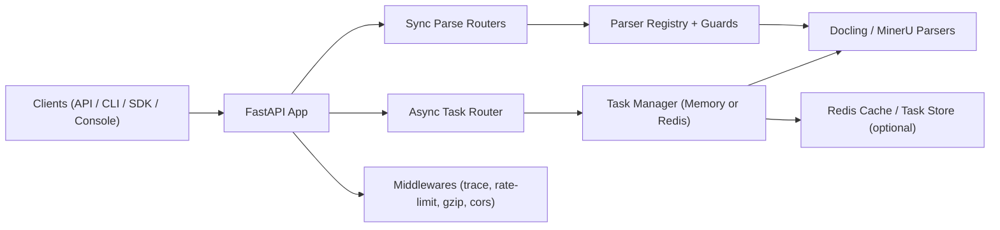

<div align="center">
  
  <h1>Markio</h1>
  <p><strong>Unified document parsing platform built with FastAPI + Docling + MinerU</strong></p>
  <p>
    <a href="https://www.python.org/"></a>
    <a href="https://fastapi.tiangolo.com/"></a>
    <a href="https://vuejs.org/"></a>
    <a href="LICENSE"></a>
  </p>
  <p><strong>English</strong> | <a href="README.zh.md">中文</a></p>
</div>

---

## Overview

Markio is an API-first service that converts documents and web content into Markdown/structured text, with:

- Sync parsing endpoints (`/v1/parse_*`, `/v1/parse_file`, `/v1/parse_url`)
- Async task queue with retry/cancel/pause/resume (`/v1/tasks/*`)
- Optional Redis-backed queue/state/cache
- Vue 3 console at `/console`
- Local SDK + CLI for direct integration

> **Breaking change:** all `/v1/*` endpoints now require `Authorization: Bearer <JWT>`.

This repository is currently in **alpha** (`0.1.0`) and focuses on practical parsing workflows over heavy platform features.

## Highlights

- **Unified parse contract** with `parsed_content`, `parser`, `source_type`, `request_id`, and `duration_ms`
- **Broad format coverage**: Office files, PDF, HTML, EPUB, image OCR, URL, FASTA, GenBank
- **Queue observability**: task stats, queue health, dashboard, per-task processing latency
- **Operational safety**: upload size limits, strict output directory guard, consistent JSON error model, request ID tracing, rate limiting
- **Flexible deployment**: local Python, Docker Compose, optional Redis backend
- **Developer ergonomics**: typed FastAPI routes, SDK/CLI, and comprehensive pytest suite

## Architecture (Simplified)



## Supported Inputs

| Type | Extensions / Source | Dedicated Endpoint | Supported by `/v1/parse_file` |
|---|---|---|---|
| PDF | `.pdf` | `/v1/parse_pdf_file` | ✅ |
| Word | `.doc`, `.docx` | `/v1/parse_doc_file`, `/v1/parse_docx_file` | ✅ |
| PowerPoint | `.ppt`, `.pptx` | `/v1/parse_ppt_file`, `/v1/parse_pptx_file` | ✅ |
| Excel | `.xlsx` | `/v1/parse_xlsx_file` | ✅ |
| HTML File | `.html`, `.htm` | `/v1/parse_html_file` | ✅ |
| EPUB | `.epub` | `/v1/parse_epub_file` | ✅ |
| Image OCR | `.png`, `.jpg`, `.jpeg` | `/v1/parse_image_file` | ✅ |
| URL | `http(s)://...` | `/v1/parse_url` | ❌ |
| FASTA | `.fasta`, `.fa`, `.fna`, `.faa`, `.ffn`, `.fsa`, `.fas`, `.txt` | `/v1/parse_fasta_file` | ❌ |
| GenBank | `.gb`, `.gbk`, `.genbank`, `.gbff`, `.txt` | `/v1/parse_genbank_file` | ❌ |

## Quick Start

### Prerequisites

- Python `3.11+`
- [`uv`](https://docs.astral.sh/uv/) (recommended)
- Node.js `18+` (for frontend development)
- Optional: Docker + Docker Compose
- Optional: Redis (`TASK_QUEUE_BACKEND=redis` + `REDIS_ENABLED=true`)
- Optional: LibreOffice (`.doc` and `.ppt` conversion support)

### Run Backend Locally

```bash
git clone https://github.com/Tendo33/markio.git
cd markio

uv sync
uv pip install -e .

cp .env.example .env
python markio/main.py
```

Open:

- API docs: [http://localhost:8000/docs](http://localhost:8000/docs)
- Console: [http://localhost:8000/console](http://localhost:8000/console)
- Health: [http://localhost:8000/healthz](http://localhost:8000/healthz)

### Run with Docker Compose

```bash
docker compose up -d
```

### Run Frontend in Dev Mode (Optional)

```bash
cd frontend
npm install
npm run dev
```

## Common Workflows

### 1) Sync Parse a Local File (Auto Dispatch)

```bash
curl -X POST "http://localhost:8000/v1/parse_file" \
  -H "Authorization: Bearer <YOUR_JWT>" \
  -F "file=@./sample.docx"
```

### 2) Parse a URL

```bash
curl -X POST "http://localhost:8000/v1/parse_url?url=https://example.com" \
  -H "Authorization: Bearer <YOUR_JWT>"
```

### 3) Submit an Async Task + Query Progress

```bash
# submit
curl -X POST "http://localhost:8000/v1/tasks/submit" \
  -H "Authorization: Bearer <YOUR_JWT>" \
  -F "file=@./sample.pdf" \
  -F "parse_method=auto" \
  -F "lang=ch" \
  -F "priority=5"

# list
curl -H "Authorization: Bearer <YOUR_JWT>" \
  "http://localhost:8000/v1/tasks?page=1&page_size=20"

# dashboard
curl -H "Authorization: Bearer <YOUR_JWT>" \
  "http://localhost:8000/v1/tasks/dashboard"
```

> `task_id` is expected to be a 32-char lowercase hex string.

## API Surface

Base prefix: `/v1`

### Sync Parse Endpoints

- `POST /parse_file` (extension-based dispatch)
- `POST /parse_pdf_file`
- `POST /parse_doc_file`
- `POST /parse_docx_file`
- `POST /parse_ppt_file`
- `POST /parse_pptx_file`
- `POST /parse_xlsx_file`
- `POST /parse_html_file`
- `POST /parse_epub_file`
- `POST /parse_image_file`
- `POST /parse_url`
- `POST /parse_fasta_file`
- `POST /parse_genbank_file`

### Async Task Endpoints

- `POST /tasks/submit`
- `GET /tasks`
- `GET /tasks/stats`
- `GET /tasks/queue`
- `GET /tasks/dashboard`
- `GET /tasks/{task_id}`
- `POST /tasks/queue/pause`
- `POST /tasks/queue/resume`
- `POST /tasks/{task_id}/cancel`
- `POST /tasks/{task_id}/retry`

### Service Endpoints

- `GET /healthz`
- `GET /readyz`
- `GET /` (redirect to `/docs`)
- `GET /console` (frontend static app / fallback page)

## CLI & SDK

After editable installation, CLI entrypoint is available as `markio`.

```bash
markio pdf ./sample.pdf --method auto
markio docx ./sample.docx --save
markio image ./sample.png

# optional remote API mode + JWT
markio --api-base-url http://localhost:8000 --token <YOUR_JWT> url https://example.com
```

Python SDK example:

```python
import asyncio
from markio.sdk.markio_sdk import MarkioSDK

async def main():
    sdk = MarkioSDK(output_dir="outputs")
    result = await sdk.parse_pdf("sample.pdf", parse_method="auto")
    print(result["content"][:500])

asyncio.run(main())
```

Remote SDK mode (JWT auto-attached):
```python
sdk = MarkioSDK(
    output_dir="outputs",
    api_base_url="http://localhost:8000",
    token="<YOUR_JWT>",
)
```

More:

- CLI guide: [docs/cli_usage.md](docs/cli_usage.md)
- SDK guide: [docs/sdk_usage.md](docs/sdk_usage.md)

## Configuration

Core settings come from environment variables (`.env`, see `.env.example`).

| Variable | Default | Notes |
|---|---|---|
| `PDF_PARSE_ENGINE` | `pipeline` | `pipeline`, `vlm-vllm-engine`, `vlm-vllm-client` |
| `MINERU_DEVICE_MODE` | `cuda` | `cuda`, `cpu`, `mps` |
| `REDIS_ENABLED` | `false` | Enables Redis cache and Redis task backend |
| `TASK_QUEUE_BACKEND` | `memory` | `memory` or `redis` |
| `TASK_WORKER_COUNT` | `2` | Background workers |
| `TASK_MAX_UPLOAD_SIZE_BYTES` | `52428800` | Upload cap (`413` on overflow) |
| `TASK_MAX_AUTO_RETRIES` | `0` | Auto-retry limit |
| `TASK_PROCESSING_TIMEOUT_SECONDS` | `0` | Requeue timeout for processing tasks |
| `RATE_LIMIT_ENABLED` | `true` | Lightweight per-IP + route limiter |
| `ENABLE_MCP` | `false` | Mount MCP endpoints/tools |
| `AUTH_JWT_SECRET` | _(required)_ | HS256 secret for `/v1/*` auth |
| `AUTH_JWT_ALGORITHM` | `HS256` | JWT algorithm (`HS256` only) |
| `MARKIO_API_TOKEN` | `""` | SDK/CLI/Gradio bearer token |
| `MARKIO_API_BASE_URL` | `""` | SDK/CLI remote API base URL |

Redis details: [docs/REDIS_INTEGRATION.md](docs/REDIS_INTEGRATION.md)

JWT claim requirements:
- required: `sub`
- `role=admin` required for `/v1/tasks/queue/pause` and `/v1/tasks/queue/resume`

## Project Structure

```text
markio/
├── markio/          # FastAPI app, routers, parsers, services, SDK/CLI
├── frontend/        # Vue 3 + Vite console
├── tests/           # pytest suites and fixtures
├── docs/            # usage docs and design plans
├── scripts/         # helper scripts
├── data/ logs/ outputs/
├── compose.yaml
└── .env.example
```

## Testing

```bash
# default suite (excludes live tests by marker)
uv run pytest

# tests requiring external running service
uv run pytest -m live
```

## Documentation Index

- CLI: [docs/cli_usage.md](docs/cli_usage.md)
- SDK: [docs/sdk_usage.md](docs/sdk_usage.md)
- Console frontend: [docs/console_frontend.md](docs/console_frontend.md)
- Biological parsing: [docs/biological_data_parsing.md](docs/biological_data_parsing.md)
- Redis integration: [docs/REDIS_INTEGRATION.md](docs/REDIS_INTEGRATION.md)

## License

- Project license: [MIT](LICENSE)
- Frontend third-party notice: [frontend/THIRD_PARTY_NOTICES.md](frontend/THIRD_PARTY_NOTICES.md)
