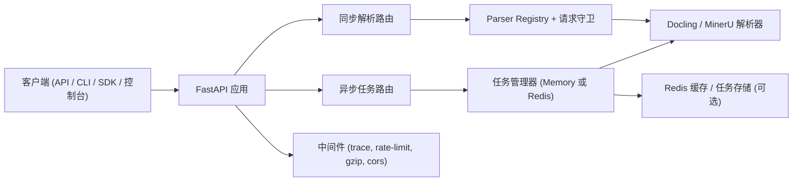

<div align="center">
  
  <h1>Markio</h1>
  <p><strong>基于 FastAPI + Docling + MinerU 的统一文档解析平台</strong></p>
  <p>
    <a href="https://www.python.org/"></a>
    <a href="https://fastapi.tiangolo.com/"></a>
    <a href="https://vuejs.org/"></a>
    <a href="LICENSE"></a>
  </p>
  <p><a href="README.md">English</a> | <strong>中文</strong></p>
</div>

---

## 项目简介

Markio 是一个 API 优先的服务，用于将文档与网页内容转换为 Markdown / 结构化文本，提供：

- 同步解析接口（`/v1/parse_*`、`/v1/parse_file`、`/v1/parse_url`）
- 支持重试/取消/暂停/恢复的异步任务队列（`/v1/tasks/*`）
- 可选的 Redis 队列/状态存储/缓存
- `/console` 下的 Vue 3 控制台
- 可直接集成的本地 SDK + CLI

当前仓库版本为 **alpha**（`0.1.0`），重点聚焦实用解析能力，而非重型平台化功能。

## 核心亮点

- **统一响应协议**：`parsed_content`、`parser`、`source_type`、`request_id`、`duration_ms`
- **格式覆盖广**：Office、PDF、HTML、EPUB、图片 OCR、URL、FASTA、GenBank
- **队列可观测**：任务统计、队列健康、仪表盘、任务处理耗时
- **运行安全性**：上传大小限制、严格输出目录约束、统一 JSON 错误模型、请求 ID 追踪、限流
- **部署灵活**：本地 Python、Docker Compose、可选 Redis 后端
- **开发友好**：类型化 FastAPI 路由、SDK/CLI、完整 pytest 测试集

## 架构概览（简化）



## 支持输入类型

| 类型 | 扩展名 / 来源 | 专用接口 | `/v1/parse_file` 是否支持 |
|---|---|---|---|
| PDF | `.pdf` | `/v1/parse_pdf_file` | ✅ |
| Word | `.doc`, `.docx` | `/v1/parse_doc_file`、`/v1/parse_docx_file` | ✅ |
| PowerPoint | `.ppt`, `.pptx` | `/v1/parse_ppt_file`、`/v1/parse_pptx_file` | ✅ |
| Excel | `.xlsx` | `/v1/parse_xlsx_file` | ✅ |
| HTML 文件 | `.html`, `.htm` | `/v1/parse_html_file` | ✅ |
| EPUB | `.epub` | `/v1/parse_epub_file` | ✅ |
| 图片 OCR | `.png`, `.jpg`, `.jpeg` | `/v1/parse_image_file` | ✅ |
| URL | `http(s)://...` | `/v1/parse_url` | ❌ |
| FASTA | `.fasta`, `.fa`, `.fna`, `.faa`, `.ffn`, `.fsa`, `.fas`, `.txt` | `/v1/parse_fasta_file` | ❌ |
| GenBank | `.gb`, `.gbk`, `.genbank`, `.gbff`, `.txt` | `/v1/parse_genbank_file` | ❌ |

## 快速开始

### 环境要求

- Python `3.11+`
- 推荐使用 [`uv`](https://docs.astral.sh/uv/)
- Node.js `18+`（前端开发时需要）
- 可选：Docker + Docker Compose
- 可选：Redis（`TASK_QUEUE_BACKEND=redis` + `REDIS_ENABLED=true`）
- 可选：LibreOffice（支持 `.doc` 与 `.ppt` 转换）

### 本地启动后端

```bash
git clone https://github.com/Tendo33/markio.git
cd markio

uv sync
uv pip install -e .

cp .env.example .env
python markio/main.py
```

访问：

- API 文档：[http://localhost:8000/docs](http://localhost:8000/docs)
- 控制台：[http://localhost:8000/console](http://localhost:8000/console)
- 健康检查：[http://localhost:8000/healthz](http://localhost:8000/healthz)

### Docker Compose 启动

```bash
docker compose up -d
```

### 前端开发模式（可选）

```bash
cd frontend
npm install
npm run dev
```

## 常见工作流

### 1）同步解析本地文件（自动分发）

```bash
curl -X POST "http://localhost:8000/v1/parse_file" \
  -F "file=@./sample.docx"
```

### 2）解析 URL

```bash
curl -X POST "http://localhost:8000/v1/parse_url?url=https://example.com"
```

### 3）提交异步任务并查询进度

```bash
# 提交任务
curl -X POST "http://localhost:8000/v1/tasks/submit" \
  -F "file=@./sample.pdf" \
  -F "parse_method=auto" \
  -F "lang=ch" \
  -F "priority=5"

# 查询任务列表
curl "http://localhost:8000/v1/tasks?page=1&page_size=20"

# 查询仪表盘
curl "http://localhost:8000/v1/tasks/dashboard"
```

> `task_id` 需要是 32 位小写十六进制字符串。

## API 概览

基础前缀：`/v1`

### 同步解析接口

- `POST /parse_file`（按扩展名自动分发）
- `POST /parse_pdf_file`
- `POST /parse_doc_file`
- `POST /parse_docx_file`
- `POST /parse_ppt_file`
- `POST /parse_pptx_file`
- `POST /parse_xlsx_file`
- `POST /parse_html_file`
- `POST /parse_epub_file`
- `POST /parse_image_file`
- `POST /parse_url`
- `POST /parse_fasta_file`
- `POST /parse_genbank_file`

### 异步任务接口

- `POST /tasks/submit`
- `GET /tasks`
- `GET /tasks/stats`
- `GET /tasks/queue`
- `GET /tasks/dashboard`
- `GET /tasks/{task_id}`
- `POST /tasks/queue/pause`
- `POST /tasks/queue/resume`
- `POST /tasks/{task_id}/cancel`
- `POST /tasks/{task_id}/retry`

### 服务接口

- `GET /healthz`
- `GET /readyz`
- `GET /`（重定向到 `/docs`）
- `GET /console`（前端静态站点 / 降级提示页）

## CLI 与 SDK

完成可编辑安装后，可直接使用 `markio` 命令。

```bash
markio pdf ./sample.pdf --method auto
markio docx ./sample.docx --save
markio image ./sample.png
```

Python SDK 示例：

```python
import asyncio
from markio.sdk.markio_sdk import MarkioSDK

async def main():
    sdk = MarkioSDK(output_dir="outputs")
    result = await sdk.parse_pdf("sample.pdf", parse_method="auto")
    print(result["content"][:500])

asyncio.run(main())
```

更多文档：

- CLI 指南：[docs/cli_usage_zh.md](docs/cli_usage_zh.md)
- SDK 指南：[docs/sdk_usage_zh.md](docs/sdk_usage_zh.md)

## 配置说明

核心配置由环境变量驱动（`.env`，详见 `.env.example`）。

| 变量 | 默认值 | 说明 |
|---|---|---|
| `PDF_PARSE_ENGINE` | `pipeline` | `pipeline`、`vlm-vllm-engine`、`vlm-vllm-client` |
| `MINERU_DEVICE_MODE` | `cuda` | `cuda`、`cpu`、`mps` |
| `REDIS_ENABLED` | `false` | 启用 Redis 缓存与 Redis 任务后端 |
| `TASK_QUEUE_BACKEND` | `memory` | `memory` 或 `redis` |
| `TASK_WORKER_COUNT` | `2` | 后台 worker 数量 |
| `TASK_MAX_UPLOAD_SIZE_BYTES` | `52428800` | 上传大小上限（超限返回 `413`） |
| `TASK_MAX_AUTO_RETRIES` | `0` | 自动重试次数上限 |
| `TASK_PROCESSING_TIMEOUT_SECONDS` | `0` | 处理中任务的超时回收阈值 |
| `RATE_LIMIT_ENABLED` | `true` | 按 IP + 路由的轻量限流 |
| `ENABLE_MCP` | `false` | 挂载 MCP 相关端点/工具 |

Redis 详情见：[docs/REDIS_INTEGRATION.md](docs/REDIS_INTEGRATION.md)

## 项目结构

```text
markio/
├── markio/          # FastAPI 应用、路由、解析器、服务、SDK/CLI
├── frontend/        # Vue 3 + Vite 控制台
├── tests/           # pytest 测试与样例数据
├── docs/            # 使用文档与设计方案
├── scripts/         # 辅助脚本
├── data/ logs/ outputs/
├── compose.yaml
└── .env.example
```

## 测试

```bash
# 默认测试集（通过 marker 排除 live 测试）
uv run pytest

# 需要外部服务的 live 测试
uv run pytest -m live
```

## 文档索引

- CLI： [docs/cli_usage_zh.md](docs/cli_usage_zh.md)
- SDK： [docs/sdk_usage_zh.md](docs/sdk_usage_zh.md)
- 控制台前端： [docs/console_frontend_zh.md](docs/console_frontend_zh.md)
- 生物数据解析： [docs/biological_data_parsing_zh.md](docs/biological_data_parsing_zh.md)
- Redis 集成： [docs/REDIS_INTEGRATION.md](docs/REDIS_INTEGRATION.md)

## License

- 项目许可证：[MIT](LICENSE)
- 前端三方声明：[frontend/THIRD_PARTY_NOTICES.md](frontend/THIRD_PARTY_NOTICES.md)
