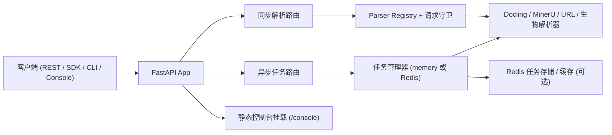

<div align="center">
  
  <h1>Markio</h1>
  <p><strong>基于 FastAPI、Docling 与 MinerU 的 API 优先文档解析平台</strong></p>
  <p>
    <a href="https://www.python.org/"></a>
    <a href="https://fastapi.tiangolo.com/"></a>
    <a href="https://vuejs.org/"></a>
    <a href="LICENSE"></a>
  </p>
  <p><a href="README.md">English</a> | <strong>中文</strong></p>
</div>

---

## 项目简介

Markio 提供四种主要交付面：

- `/v1/parse_*` 同步解析接口
- `/v1/tasks/*` 异步任务队列接口
- 本地 Python SDK 与 CLI
- 由 FastAPI 托管在 `/console` 的 Vue 3 控制台

当前版本为 **alpha**（`0.1.3`）。它已经适合内部环境、staging 与集成开发，但还不应被表述为完全成熟的 GA 平台。

## 当前产品形态

- **主 Web 界面**：`/console` 下的 Vue 控制台
- **补充界面**：可选的 Gradio 预览界面
- **鉴权模型**：所有 `/v1/*` 路由都要求 `Authorization: Bearer <JWT>`
- **任务后端**：默认内存队列，可选 Redis
- **URL 解析**：本地 parser、本地 SDK URL 模式、远程 `/v1/parse_url` 共用一套 URL 安全策略

### 当前支持的输入

| 输入类型 | 专用接口 | `/v1/parse_file` 自动分发 |
|---|---|---|
| PDF | `/v1/parse_pdf_file` | 是 |
| DOC / DOCX | `/v1/parse_doc_file`、`/v1/parse_docx_file` | 是 |
| PPT / PPTX | `/v1/parse_ppt_file`、`/v1/parse_pptx_file` | 是 |
| XLSX | `/v1/parse_xlsx_file` | 是 |
| HTML / HTM | `/v1/parse_html_file` | 是 |
| EPUB | `/v1/parse_epub_file` | 是 |
| 图片 OCR | `/v1/parse_image_file` | 是 |
| URL | `/v1/parse_url` | 否 |
| FASTA | `/v1/parse_fasta_file` | 否 |
| GenBank | `/v1/parse_genbank_file` | 否 |

## 架构概览



## 快速开始

### 环境要求

- Python `3.11+`
- 推荐使用 [`uv`](https://docs.astral.sh/uv/)
- Node.js `18+`，用于前端开发和 console 构建
- 可选：Docker + Docker Compose
- 可选：LibreOffice，用于 `.doc` 与 `.ppt`
- 可选：Redis，用于 `TASK_QUEUE_BACKEND=redis`

### 本地启动后端

```bash
git clone https://github.com/Tendo33/markio.git
cd markio

uv sync
uv pip install -e .

cp .env.example .env
python markio/main.py
```

启动前必须设置：

- `.env` 中的 `AUTH_JWT_SECRET`

可访问：

- API 文档：[http://localhost:8000/docs](http://localhost:8000/docs)
- 健康检查：[http://localhost:8000/healthz](http://localhost:8000/healthz)

### 构建控制台

只有当 Vue 构建产物存在于 `markio/webapp` 时，后端才会把 `/console` 作为 SPA 正常托管。

```bash
cd frontend
npm install
npm run build
cd ..
```

然后访问：

- 控制台：[http://localhost:8000/console](http://localhost:8000/console)

若构建产物缺失，`/console` 会返回提示用的 fallback 页面，而不是一个损坏的 SPA，这属于设计内的保护行为。

### Docker Compose

```bash
export AUTH_JWT_SECRET="<高强度随机密钥>"
export REDIS_PASSWORD="<redis-password>"
docker compose up -d
```

Compose 默认采用同源部署：API 在 `/v1/*`，console 在 `/console`，Redis 仅在内部网络暴露。

## 常见工作流

### 同步解析本地文件

```bash
curl -X POST "http://localhost:8000/v1/parse_file" \
  -H "Authorization: Bearer <YOUR_JWT>" \
  -F "file=@./sample.docx"
```

### 解析 URL

```bash
curl -X POST "http://localhost:8000/v1/parse_url?url=https://example.com" \
  -H "Authorization: Bearer <YOUR_JWT>"
```

### 提交异步任务

```bash
curl -X POST "http://localhost:8000/v1/tasks/submit" \
  -H "Authorization: Bearer <YOUR_JWT>" \
  -F "file=@./sample.pdf" \
  -F "parse_method=auto" \
  -F "lang=ch" \
  -F "priority=5"
```

### 查询任务状态

```bash
curl -H "Authorization: Bearer <YOUR_JWT>" \
  "http://localhost:8000/v1/tasks?page=1&page_size=20"

curl -H "Authorization: Bearer <YOUR_JWT>" \
  "http://localhost:8000/v1/tasks/dashboard"

curl -H "Authorization: Bearer <ADMIN_JWT>" \
  "http://localhost:8000/v1/tasks/queue"
```

## CLI 与 SDK

完成可编辑安装后，可直接使用 `markio` CLI。

```bash
markio pdf ./sample.pdf --method auto
markio docx ./sample.docx --save
markio url https://example.com
```

远程模式：

```bash
markio --api-base-url http://localhost:8000 --token <YOUR_JWT> pdf ./sample.pdf --save
```

Python SDK：

```python
import asyncio
from markio.sdk.markio_sdk import MarkioSDK

async def main():
    sdk = MarkioSDK(output_dir="outputs")
    result = await sdk.parse_pdf("sample.pdf", parse_method="auto")
    print(result["content"][:500])

asyncio.run(main())
```

远程 SDK 模式：

```python
sdk = MarkioSDK(
    output_dir="outputs",
    api_base_url="http://localhost:8000",
    token="<YOUR_JWT>",
)
```

## 当前安全基线

### API 鉴权

- 所有 `/v1/*` 路由都要求 JWT
- `role=admin` 才能调用队列暂停/恢复相关接口
- `/v1/tasks/dashboard` 是 owner-scoped 的，普通用户只能看到自己的任务统计与最近任务
- 当前 console 仍保留前端托管 token 的模式，并通过 `localStorage` 在浏览器侧持久化

### MCP 行为

- `/v1/mcp/*` 与 legacy `/mcp/*` 在校验失败或解析失败时都会返回标准 FastAPI 非 2xx 错误包
- legacy `/mcp/*` 仍保留废弃提示响应头

### URL 解析与下载安全

URL 获取统一收敛到 `markio/parsers/url_parser.py`：

- 仅允许 `http` 与 `https`
- 可通过 `URL_ALLOWED_DOMAINS` 配置域名白名单
- 默认拦截私网、回环、链路本地、多播、保留和未指定地址
- 限制超时、响应大小、最大跳转次数
- redirect 目标会再次校验
- direct 模式下，已验证 IP 会被 pin 到真实连接层

相关环境变量：

- `URL_FETCH_MODE`
- `URL_PROXY_BASE`
- `URL_REQUEST_TIMEOUT_SECONDS`
- `URL_MAX_RESPONSE_BYTES`
- `URL_BLOCK_PRIVATE_NETWORKS`
- `URL_ALLOWED_DOMAINS`
- `URL_MAX_REDIRECTS`

## 配置说明

核心配置来自 `.env` 与 `markio/settings/config_model.py`。

| 变量 | 默认值 | 作用 |
|---|---|---|
| `AUTH_JWT_SECRET` | `""` | 所有 `/v1/*` 路由必需的 JWT 密钥 |
| `AUTH_JWT_ALGORITHM` | `HS256` | JWT 算法 |
| `CORS_ALLOW_ORIGINS` | `""` | 为空时仅允许同源 |
| `REDIS_ENABLED` | `false` | 启用 Redis 能力 |
| `TASK_QUEUE_BACKEND` | `memory` | `memory` 或 `redis` |
| `TASK_WORKER_COUNT` | `2` | 异步任务 worker 数 |
| `TASK_MAX_UPLOAD_SIZE_BYTES` | `52428800` | 异步上传大小上限 |
| `RATE_LIMIT_ENABLED` | `true` | 轻量限流 |
| `ENABLE_MCP` | `false` | 挂载 MCP 端点 |
| `MARKIO_API_BASE_URL` | `""` | SDK/CLI 远程模式地址 |
| `MARKIO_API_TOKEN` | `""` | SDK/CLI 远程 Bearer token |

Redis 细节见：[docs/REDIS_INTEGRATION.md](docs/REDIS_INTEGRATION.md)

## 文档导航

- CLI 指南：[docs/cli_usage_zh.md](docs/cli_usage_zh.md)
- SDK 指南：[docs/sdk_usage_zh.md](docs/sdk_usage_zh.md)
- Console 指南：[docs/console_frontend_zh.md](docs/console_frontend_zh.md)
- 生物数据解析指南：[docs/biological_data_parsing_zh.md](docs/biological_data_parsing_zh.md)
- Redis 指南：[docs/REDIS_INTEGRATION.md](docs/REDIS_INTEGRATION.md)
- 测试说明：[tests/README.md](tests/README.md)

## 测试

主要命令：

```bash
uv run pytest
uv run pytest -m live
cd frontend && npm run build
```

当前以 pytest 为主事实来源。`tests/` 下仍保留部分历史脚本，但推荐直接运行 pytest。

## 项目结构

```text
markio/
├── markio/         # FastAPI 应用、解析器、路由、SDK、配置
├── frontend/       # Vue 3 + Vite 控制台源码
├── docs/           # 用户与运维文档
├── tests/          # Pytest 测试与测试样例
├── data/           # 运行时任务状态与上传文件
├── logs/           # 运行日志
└── outputs/        # 解析结果输出
```

## 已知边界

- 项目仍处于 alpha，而非 GA
- console 仍采用前端 token 模式
- 队列暂停/恢复与全局队列健康度是 admin-only；dashboard 仍然是 owner-scoped
- FASTA 与 GenBank 目前没有一层统一的 CLI 命令或 `MarkioSDK` façade；请使用 REST 接口或 parser 模块
- `/console` 的 fallback 页面是刻意保留的降级提示，不是主链路
